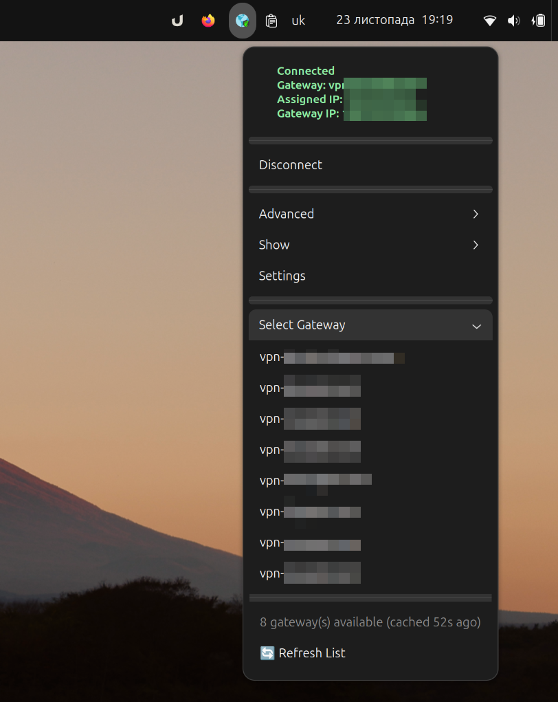

# gp-gnome

[](https://www.gnu.org/licenses/gpl-3.0)
[](https://www.gnome.org/)
[](CHANGELOG.md)
[](https://github.com/totoshko88/gp-gnome/actions/workflows/ci.yml)

GNOME Shell extension for GlobalProtect VPN CLI integration. Native system tray indicator with full VPN management.

> **Note**: Designed for [GlobalProtect CLI](https://docs.paloaltonetworks.com/globalprotect) (PanGPLinux) - the official Palo Alto Networks VPN client for Linux.



## Features

| Category | Features |
|----------|----------|
| **Connection** | Connect/Disconnect with MFA support, Gateway selection, Auto-disconnect on logout |
| **Monitoring** | Real-time status, Configurable polling (3-60s), Custom status icons |
| **Settings** | Portal address, Username, SSL-only mode, Log level, Certificate import |
| **Advanced** | Network rediscovery, HIP resubmission, Log collection, Diagnostics |
| **Info** | Host state (HIP), Errors, Notifications, Help, Version |

## Requirements

- GNOME Shell 45, 46, 47, 48, or 49
- GlobalProtect CLI installed (`globalprotect` command available)

## Installation

### From Release (Recommended)

```bash
# Download and install
wget https://github.com/totoshko88/gp-gnome/releases/latest/download/gp-gnome@totoshko88.github.io.zip
gnome-extensions install gp-gnome@totoshko88.github.io.zip --force
gnome-extensions enable gp-gnome@totoshko88.github.io

# Restart GNOME Shell
# Wayland: Log out and back in
# X11: Alt+F2 → r → Enter
```

### From Source

```bash
git clone https://github.com/totoshko88/gp-gnome.git
cd gp-gnome
make install
gnome-extensions enable gp-gnome@totoshko88.github.io
```

## Quick Start

1. Click the extension icon in system tray
2. Open **Settings** → Set your portal address
3. Click **Connect**
4. Complete MFA in browser if prompted

### Status Icons

| Icon | State |
|------|-------|
| 🟢 Green | Connected |
| 🔴 Red | Disconnected |
| 🟡 Yellow | Connecting/Disconnecting |
| 🟠 Orange | Error |

## Configuration

### Via Settings Dialog

Click extension icon → **Settings**

### Via Command Line

```bash
gsettings set org.gnome.shell.extensions.gp-gnome portal-address "vpn.example.com"
gsettings set org.gnome.shell.extensions.gp-gnome poll-interval 10
gsettings set org.gnome.shell.extensions.gp-gnome username "your-username"
gsettings set org.gnome.shell.extensions.gp-gnome ssl-only true
```

## Troubleshooting

### Extension not appearing

```bash
# Check if enabled
gnome-extensions list --enabled | grep gp-gnome

# Check logs
journalctl -f -o cat /usr/bin/gnome-shell | grep -i gp-gnome

# Restart GNOME Shell (Wayland: log out/in, X11: Alt+F2 → r)
```

### Connection issues

```bash
# Verify CLI works
globalprotect show --status

# Check CLI version
globalprotect --version
```

### Settings not saving

```bash
# Recompile schema
cd ~/.local/share/gnome-shell/extensions/gp-gnome@totoshko88.github.io/
glib-compile-schemas schemas/
```

## Development

```bash
# Run tests
make test

# Create distribution package
make dist

# Validate against EGO guidelines
bash tests/validate-review-guidelines.sh
```

## Documentation

- [CHANGELOG.md](CHANGELOG.md) - Version history
- [CONTRIBUTING.md](CONTRIBUTING.md) - How to contribute
- [DISTRIBUTION.md](DISTRIBUTION.md) - Release process

## Support

[](https://ko-fi.com/totoshko88)
[](https://www.paypal.com/qrcodes/p2pqrc/JJLUXRZSQ5V3A)
[](https://send.monobank.ua/jar/2UgaGcQ3JC)

## License

GPL-3.0 — Made with ❤️ in Ukraine 🇺🇦