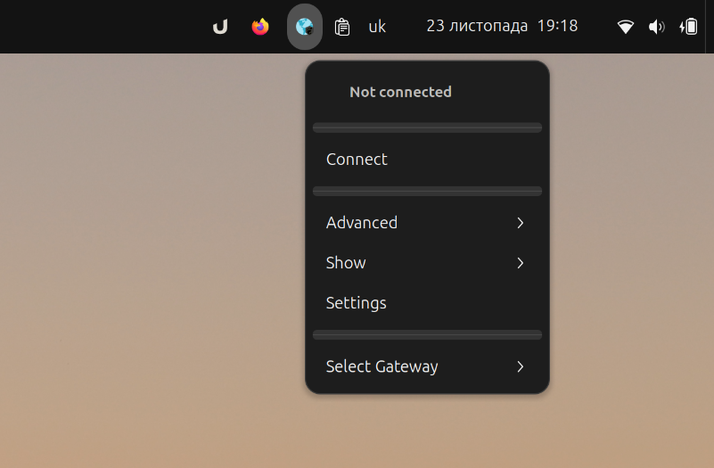
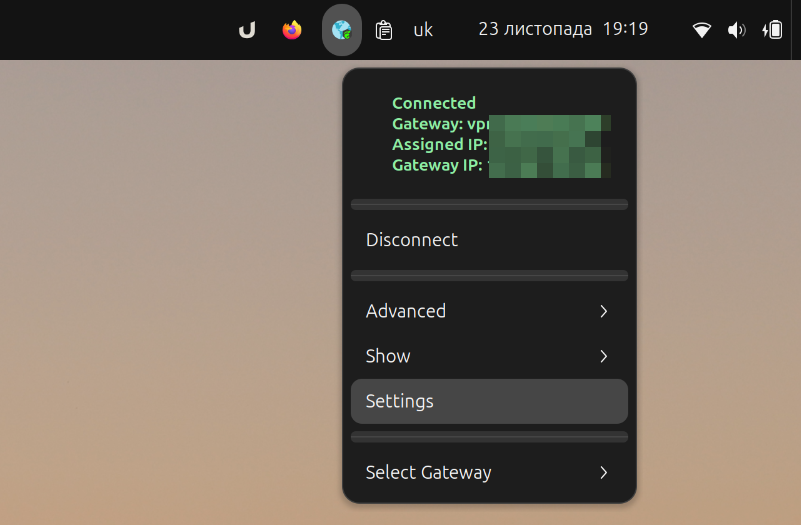
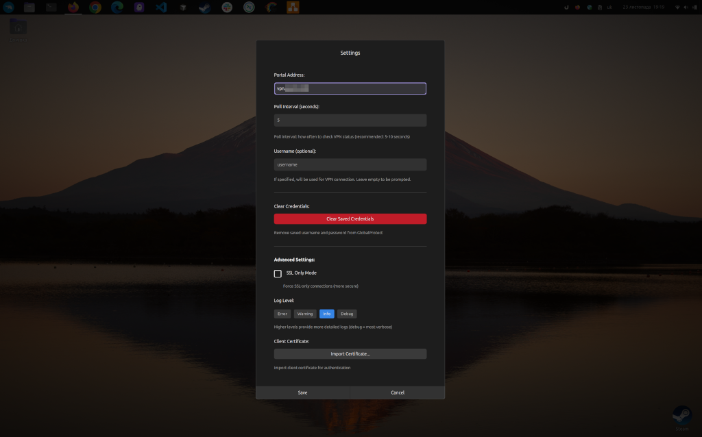
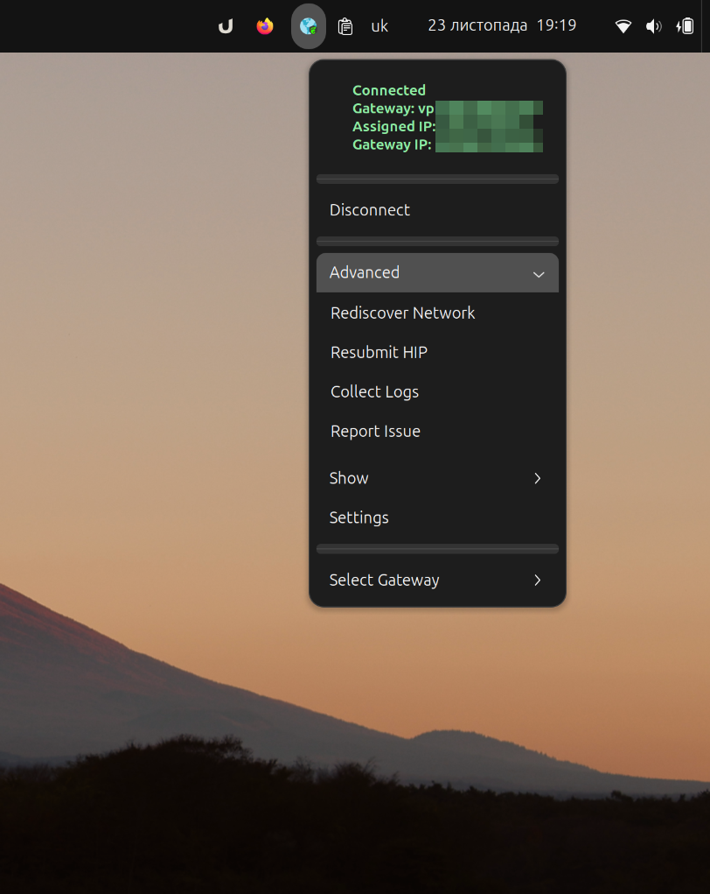
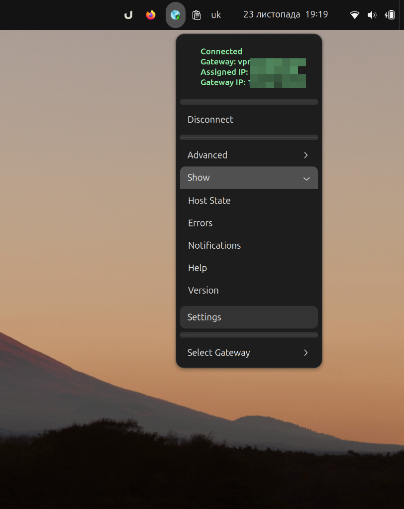
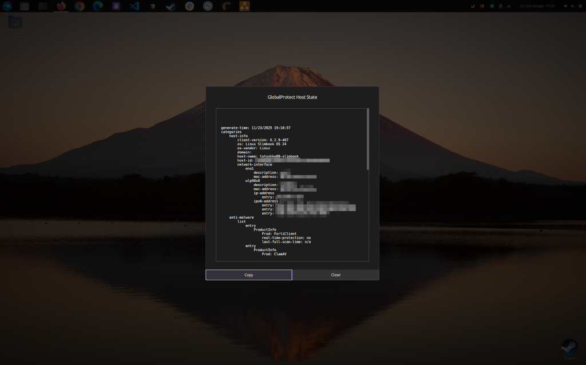
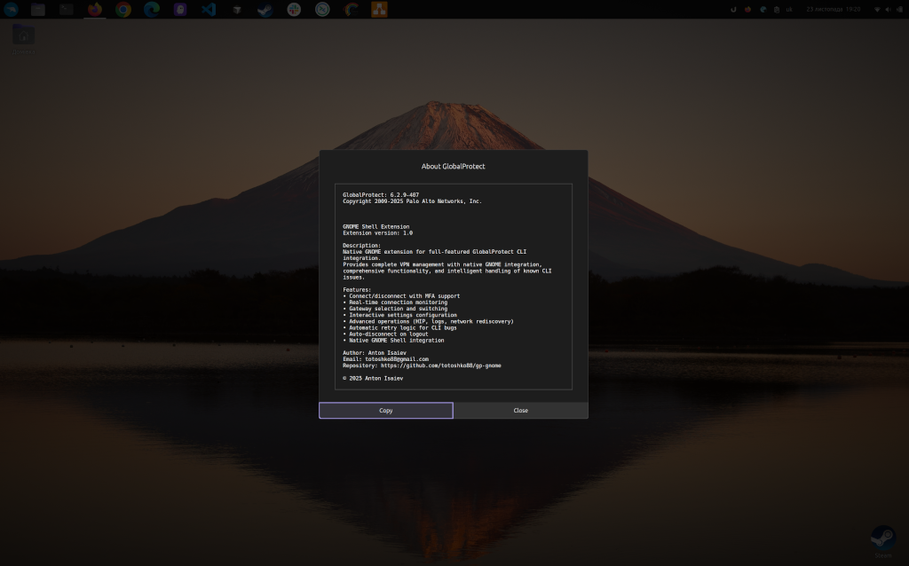

# gp-gnome - GNOME Shell Extension for GlobalProtect VPN

[](https://www.gnu.org/licenses/gpl-3.0)
[](https://www.gnome.org/)
[](CHANGELOG.md)

**gp-gnome** is a GNOME Shell extension for GlobalProtect VPN CLI (PanGPLinux) integration. Provides complete VPN management with native GNOME integration, comprehensive functionality, and intelligent handling of known CLI issues.

Designed for **GlobalProtect CLI** (also known as **PanGPLinux**) - the official Palo Alto Networks VPN client for Linux.

> **Trademark Notice**: GlobalProtect is a registered trademark of Palo Alto Networks, Inc. This extension is an independent project and is not affiliated with, endorsed by, or sponsored by Palo Alto Networks, Inc.

## ✨ Features

### Core Functionality
- 🔒 **Connect/Disconnect** with MFA (Multi-Factor Authentication) support
- 📊 **Real-time status monitoring** with configurable poll interval
- 🌐 **Gateway selection** with caching and easy switching
- 🔄 **Auto-disconnect** on logout for security
- 🎨 **Custom icons** for all connection states (connected, disconnected, connecting, error)
- 🔔 **Smart notifications** with throttling to prevent spam

### Settings & Configuration
- 🌍 **Portal address** configuration
- ⏱️ **Poll interval** customization (3-60 seconds)
- 👤 **Username** (optional) for automatic authentication
- 🔐 **SSL Only mode** for enhanced security
- 📝 **Log level** configuration (Error, Warning, Info, Debug)
- 📜 **Certificate import** with interactive dialog
- 🗑️ **Clear credentials** functionality

### Advanced Operations
- 🔍 **Rediscover network** - Refresh network configuration
- 🏥 **Resubmit HIP** - Resubmit Host Information Profile
- 📋 **Collect logs** - Gather diagnostic logs (opens folder automatically)
- 🐛 **Report issue** - Generate diagnostic report

### Information Display
- 🖥️ **Host State** - View HIP information with scrolling
- ❌ **Errors** - View error messages
- 📬 **Notifications** - View GlobalProtect notifications
- ❓ **Help** - Access GlobalProtect help
- ℹ️ **Version** - About dialog with extension info

### Technical Features
- 🔄 **Retry logic** for known GlobalProtect CLI bugs
- 🛡️ **Comprehensive error handling** with sensitive data sanitization
- 💾 **Gateway list caching** for better performance
- 📋 **Copy buttons** in all information dialogs
- 🎯 **Interactive dialogs** for all settings

## 📸 Screenshots

### Disconnected State

*Extension icon in system tray when VPN is disconnected*

### Main Menu

*Main menu showing connection status, gateway selection, and all available operations*

### Connected State

*Extension showing active VPN connection with gateway and IP information*

### Settings Dialog

*Comprehensive settings dialog with portal, username, SSL mode, log level, and certificate import*

### Advanced Operations

*Advanced operations: Rediscover Network, Resubmit HIP, Collect Logs, Report Issue*

### Show Information

*Show menu with Host State, Errors, Notifications, Help, and Version information*

### Host State (HIP)

*Detailed Host Information Profile with scrollable view and copy button*

### About Dialog

*About dialog showing extension version, features, and contact information*

## 📋 Requirements

- **GNOME Shell**: 45, 46, 47, 48, or 49
- **GlobalProtect CLI**: Installed and available in PATH
  - Usually located at `/usr/bin/globalprotect` or `/opt/paloaltonetworks/globalprotect/globalprotect`
- **VPN Access**: Valid GlobalProtect VPN portal credentials

## 📦 Installation

### From GitHub Release (Recommended)

1. Download the latest release:
```bash
wget https://github.com/totoshko88/gp-gnome/releases/download/v1.3.4/gp-gnome@totoshko88.github.io.zip
```

2. Install the extension:
```bash
gnome-extensions install gp-gnome@totoshko88.github.io.zip --force
```

3. Enable the extension:
```bash
gnome-extensions enable gp-gnome@totoshko88.github.io
```

4. Restart GNOME Shell:
   - **Wayland**: Log out and log back in
   - **X11**: Press `Alt+F2`, type `r`, press Enter

### From Source

```bash
# Clone the repository
git clone https://github.com/totoshko88/gp-gnome.git
cd gp-gnome

# Install using Make
make install

# Enable the extension
gnome-extensions enable gp-gnome@totoshko88.github.io

# Restart GNOME Shell
```

### Quick Install Script

```bash
# Clone and install
git clone https://github.com/totoshko88/gp-gnome.git
cd gp-gnome
chmod +x install.sh
./install.sh
```

### Uninstallation

```bash
# Using uninstall script
./uninstall.sh

# Or using Make
make uninstall

# Or using gnome-extensions
gnome-extensions uninstall gp-gnome@totoshko88.github.io
```

## 🚀 Usage

### First Time Setup

1. Click the gp-gnome icon in the system tray
2. Click **Settings**
3. Configure:
   - **Portal Address**: Your VPN portal (e.g., `vpn.example.com`)
   - **Poll Interval**: Status check frequency (default: 5 seconds)
   - **Username** (optional): For automatic authentication
   - **SSL Only Mode**: Force SSL-only connections
   - **Log Level**: Error, Warning, Info, or Debug
4. Click **Save**

### Connecting to VPN

1. Click the gp-gnome icon
2. Click **Connect**
3. Complete MFA authentication in browser if prompted
4. Wait for connection to establish
5. Icon will change to show connected state

### Disconnecting from VPN

1. Click the gp-gnome icon
2. Click **Disconnect**
3. Wait for disconnection to complete (~1-2 seconds)

### Connection Status Icons

The system tray icon shows current state:
- 🔴 **Off** (Red): Disconnected
- 🟡 **Connecting** (Yellow): Connecting or disconnecting
- 🟢 **On** (Green): Connected
- ⚠️ **Error** (Orange): Connection error

### Gateway Selection

1. Click the gp-gnome icon
2. Click **Select Gateway**
3. Choose from available gateways
4. Extension will disconnect and reconnect to selected gateway

### Advanced Operations

Access via **Advanced** menu:
- **Rediscover Network**: Refresh network configuration
- **Resubmit HIP**: Resubmit Host Information Profile
- **Collect Logs**: Gather diagnostic logs (opens folder)
- **Report Issue**: Generate diagnostic report

### Information Display

Access via **Show** menu:
- **Host State**: View HIP information
- **Errors**: View error messages
- **Notifications**: View GlobalProtect notifications
- **Help**: Access GlobalProtect help
- **Version**: About dialog with extension info

## ⚙️ Configuration

### Settings via UI

All settings are accessible through the **Settings** dialog:
- Portal Address
- Poll Interval (3-60 seconds)
- Username (optional)
- SSL Only Mode
- Log Level (Error/Warning/Info/Debug)
- Certificate Import

### Settings via Command Line

You can also configure using `gsettings`:

```bash
# Set portal address
gsettings set org.gnome.shell.extensions.gp-gnome portal-address "vpn.example.com"

# Set poll interval (in seconds)
gsettings set org.gnome.shell.extensions.gp-gnome poll-interval 10

# Set username
gsettings set org.gnome.shell.extensions.gp-gnome username "your-username"

# Enable SSL only mode
gsettings set org.gnome.shell.extensions.gp-gnome ssl-only true

# Set log level
gsettings set org.gnome.shell.extensions.gp-gnome log-level "debug"
```

## Troubleshooting

### Extension Not Appearing

1. Check if the extension is enabled:
```bash
gnome-extensions list --enabled | grep gp-gnome
```

2. Check for errors in the logs:
```bash
journalctl -f -o cat /usr/bin/gnome-shell | grep -i gp-gnome
```

3. Restart GNOME Shell:
   - **Wayland**: Log out and log back in
   - **X11**: Press `Alt+F2`, type `r`, press Enter

### Connection Issues

1. Verify GlobalProtect CLI is installed:
```bash
which globalprotect
globalprotect --version
```

2. Test the CLI directly:
```bash
globalprotect show --status
```

3. Check extension logs:
```bash
journalctl -f -o cat /usr/bin/gnome-shell | grep -i error
```

### Settings Not Saving

1. Recompile the GSettings schema:
```bash
cd ~/.local/share/gnome-shell/extensions/gp-gnome@totoshko88.github.io/
glib-compile-schemas schemas/
```

2. Restart GNOME Shell

### MFA Authentication Issues

1. Ensure your browser is set as default
2. Check that browser can access the portal
3. Complete authentication within timeout period
4. Check logs for specific error messages

## Development

### Running Tests

The extension includes comprehensive test suites:

```bash
# Run property-based tests (100+ iterations per property)
gjs tests/run-property-tests.js

# Run unit tests
gjs tests/run-unit-tests.js

# Run GNOME Extension Review Guidelines validation
bash tests/validate-review-guidelines.sh

# Run CLI integration tests
bash tests/test-cli-integration.sh
```

### Project Structure

```
gp-gnome@totoshko88.github.io/
├── extension.js          # Main extension class (lifecycle management)
├── prefs.js             # Preferences UI (GTK4/Adwaita)
├── indicator.js         # System tray indicator (UI component)
├── gpClient.js          # GlobalProtect CLI wrapper (async operations)
├── statusMonitor.js     # VPN status monitoring (polling)
├── errorHandler.js      # Error handling utility (sanitization)
├── metadata.json        # Extension metadata (no license fields)
├── stylesheet.css       # UI styling
├── LICENSE              # GPL-3.0-or-later
├── .eslintrc.json       # ESLint configuration
├── package.json         # npm dependencies (testing)
├── Makefile             # Build automation
├── install.sh           # Quick installation script
├── uninstall.sh         # Uninstallation script
├── schemas/             # GSettings schema
│   └── org.gnome.shell.extensions.gp-gnome.gschema.xml
├── icons/               # Custom SVG icons (scalable)
│   ├── on.svg          # Connected state
│   ├── off.svg         # Disconnected state
│   ├── connecting.svg  # Transitioning state
│   └── error.svg       # Error state
├── tests/              # Test suites
│   ├── run-property-tests.js      # Property-based tests
│   ├── run-unit-tests.js          # Unit tests
│   ├── properties/                # fast-check tests
│   ├── mocks/                     # GNOME API mocks
│   ├── test-*.sh                  # Integration tests
│   └── validate-review-guidelines.sh
└── docs/               # Documentation
    ├── screenshots/    # UI screenshots
    └── development/    # Development notes
```

### Architecture

The extension follows a modular, separation-of-concerns architecture:

- **Extension (extension.js):** Lifecycle management (enable/disable), proper cleanup order
- **GlobalProtectClient (gpClient.js):** Async CLI wrapper with Gio.Cancellable support
- **StatusMonitor (statusMonitor.js):** Periodic status polling with configurable interval
- **GlobalProtectIndicator (indicator.js):** UI component with race condition prevention
- **ErrorHandler (errorHandler.js):** Centralized error handling with data sanitization

**Key Features:**
- All operations are asynchronous (no UI blocking)
- Proper resource cleanup (timeouts, signals, subprocess)
- Cancellable operations (can be stopped on disable)
- Input validation on all public methods
- Race condition prevention with operation locks
- Icon stability during non-connection operations

## 🔒 Security

The extension implements comprehensive security measures:

- **Command Injection Prevention:** All CLI commands use array arguments (Gio.Subprocess), not shell strings
- **Sensitive Data Sanitization:** Passwords, tokens, cookies, and API keys removed from logs
- **Input Validation:** Type checking and validation on all user inputs
- **Async Operations:** No blocking operations that could freeze the UI
- **Proper Resource Cleanup:** All resources (timeouts, signals, subprocess) cleaned up on disable
- **Cancellable Operations:** All subprocess operations can be cancelled (Gio.Cancellable)
- **Auto-disconnect on Logout:** VPN automatically disconnects when user logs out
- **No Telemetry:** No user tracking or data collection

## Distribution

### Creating a Release Package

```bash
# Create distribution package
make package

# Package will be created at: dist/gp-gnome@totoshko88.github.io.zip
```

### Submitting to extensions.gnome.org

See [DISTRIBUTION.md](DISTRIBUTION.md) for detailed submission instructions.

## Contributing

Contributions are welcome! Please read [CONTRIBUTING.md](CONTRIBUTING.md) for details on our code of conduct and the process for submitting pull requests.

Quick start:

1. Fork the repository
2. Create a feature branch
3. Make your changes
4. Run the test suites
5. Submit a pull request

## 📄 License

GPL-3.0-or-later - see [LICENSE](LICENSE) file.

## 📚 Documentation

- [CHANGELOG.md](CHANGELOG.md) - Version history
- [CONTRIBUTING.md](CONTRIBUTING.md) - Contribution guidelines
- [DISTRIBUTION.md](DISTRIBUTION.md) - Release and submission instructions

## ☕ Support the Project

If you find this extension useful, consider supporting its development:

- **Ko-Fi**: [ko-fi.com/totoshko88](https://ko-fi.com/totoshko88)
- **PayPal**: totoshko88@gmail.com
- **Monobank (UAH)**: [send.monobank.ua/jar/2UgaGcQ3JC](https://send.monobank.ua/jar/2UgaGcQ3JC)

## 📞 Contact

- **Issues**: [GitHub Issues](https://github.com/totoshko88/gp-gnome/issues)
- **Email**: totoshko88@gmail.com

Copyright (C) 2025 Anton Isaiev
